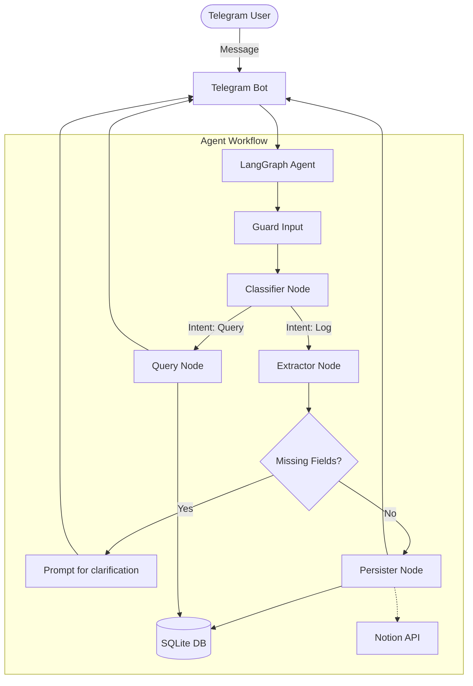

# My Tele PA (Personal Life OS Agent v2.0)

A production-grade Telegram bot agent that acts as a Personal Life OS. It tracks wellness (sleep, exercise, mood), tasks, reminders, and journal entries using LangGraph, Instructor, and GPT-4o. Outputs are rigidly validated using Pydantic, stored locally in SQLite, and conditionally synced to Notion.

## Features

- **Contextual NLP Parsing**: Handles natural conversational language to log complex life entities.
- **Query Mode**: Summarizes your historical SQLite records to answer contextual questions (e.g., "How was my sleep this week?").
- **Interactive Clarification**: Pauses generation if missing critical variables (e.g., Bedtime) and prompts you to fill in the blanks.
- **Notion Sync**: Pushes Reading Links, Tasks, Journal Entries, Exercise, and Sleep straight to designated Notion databases.
- **Proactive Schedulers**: Automatically pings you at 8am daily for check-ins and Sunday at 7pm for a weekly digest.

---

## Architecture

The underlying system runs as an asynchronous Telegram application paired with a robust Agentic Workflow:
- **LangGraph**: Orchestrates the state machine between message classification, LLM entity extraction, missing field logic, and database persistence.
- **Instructor**: Enforces deterministic JSON schemas directly from the OpenAI models.
- **Pydantic**: Validates typing and value thresholds across all extracted payloads.
- **SQLite**: Provides high-speed, localized, conversational memory and structured history storage.

### Agentic Graph Diagram



---

## File Organization

The repository is modularly designed, separating the generic Agent pipeline from the Telegram Interface.

```text
├── Dockerfile                    # Containerization instructions
├── Makefile                      # Make commands for testing, evals, format
├── cloudbuild.yaml               # CI/CD configuration
├── data/                         # SQLite database storage directory
├── fly.toml                      # Fly.io deployment configuration
├── pyproject.toml                # Project metadata and dependencies (UV)
├── simulation.py                 # End-to-end local simulation script (bypasses Telegram)
├── src/
│   └── life_os/
│       ├── agent/                # Core LangGraph agent definitions
│       │   ├── graph.py          # State graph wiring and execution compilation
│       │   ├── state.py          # Agent state typings
│       │   ├── nodes/            # Graph nodes (classifier, extractor, guard, persister, query)
│       │   └── prompts/          # System prompts for GPT-4o
│       ├── config/               # Pydantic environmental settings and structlog config
│       ├── evals/                # Evaluation datasets, metrics, and execution scripts
│       ├── integrations/         # Code interacting with databases and APIs (SQLite, Notion)
│       ├── models/               # Pydantic schemas validating inputs
│       └── telegram/             # Telegram generic handlers, webhook, and schedulers
├── tests/
│   ├── e2e/                      # End-to-end tests
│   ├── integration/              # Integration tests (verifies LangGraph node chaining)
│   └── unit/                     # Unit tests (verifies LLM extractor accuracy)
```

---

## Engineering Challenges & Solutions

1. **Conversational Memory & State Pollution**
   - *Challenge*: The LangGraph agent would remember past extractions and duplicate them across multi-turn conversations if the user was providing clarification.
   - *Solution*: Implemented SQLite-based Checkpointing (`MemorySaver`) using dynamic `thread_id` configurations. We explicitly wipe `entities` and `missing_fields` from the `AgentState` after a successful persistence action to ensure a clean state while safely maintaining conversational history in the LLM context limits.

2. **Partial Extractions & Strict Validation**
   - *Challenge*: Relying heavily on strict Pydantic schemas meant the LLM would drop actions entirely if sub-parameters were missing (e.g. "I slept 8 hours" drops because there is no Exact Bedtime).
   - *Solution*: Decoupled strict Pydantic parsing into granular `Optional` models. Designed a deep-merge strategy inside the `extractor.py` to aggregate partial payloads across dialog turns, conditionally routing inside the graph to an interactive user-clarification step until validation thresholds are met.

3. **Database Concurrency Errors**
   - *Challenge*: `aiosqlite` threw context execution errors when accessed asynchronously by the Telegram Webhook handler and background API Schedulers simultaneously.
   - *Solution*: Bound strict Context Managers, initialized global database connector pools properly, and refactored integrations to cleanly accept and execute `cursor` transactions.

4. **Regression Drop-offs during Refactoring**
   - *Challenge*: Adjusting model typings heavily distorted the accuracy of the LLM mapping outputs.
   - *Solution*: Built a customized `.jsonl` evaluation pipeline based on F1 Score tracking. Using exact precision tracking allowed instant identification of broken dictionary parsing during regression tests.

---

## Installation & Setup

1. **Clone the repository**
   ```bash
   git clone https://github.com/vaibhavd030/My-Tele-PA.git
   cd My-Tele-PA
   ```

2. **Install `uv` (Fast Python Package Installer)**
   ```bash
   curl -LsSf https://astral.sh/uv/install.sh | sh
   ```

3. **Sync Dependencies**
   ```bash
   uv sync
   ```

4. **Environment Setup**
   Copy the `.env.example` file and populate your keys. At minimum, you need an OpenAI API Key and a Telegram Bot token (from BotFather).
   ```bash
   cp .env.example .env
   ```

5. **Initialize Database**
   The SQLite database structure is automatically instantiated when you boot the bot for the first time. There is no need for manual migrations.
   ```bash
   uv run python -m life_os.telegram.bot --mode polling
   ```

---

## Running the Project

### Local Execution (Polling Mode)
Run the script to actively ping Telegram servers for incoming app messages.
```bash
uv run python -m life_os.telegram.bot --mode polling
```

### Local Simulation (Bypass Telegram)
Useful for testing agent logic quickly without accessing your phone.
```bash
uv run python simulation.py
```

### Evaluations and Tests
A test suite handles node executions, and a custom CI evaluation script tracks Agentic metric parsing accuracy over `GPT-4o`.
```bash
make test
make eval
```
