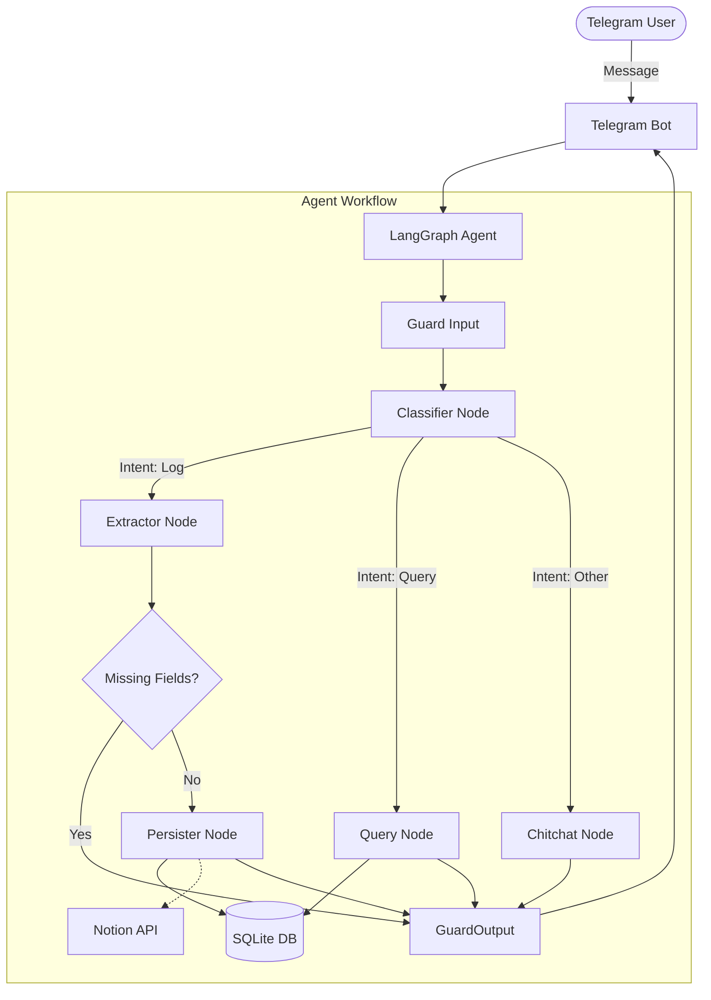

# My Tele PA (Personal Life OS Agent v2.0)

A production-grade Telegram bot agent that acts as a Personal Life OS. It tracks wellness (sleep, exercise, mood), tasks, reading links, and journal entries using LangGraph, Instructor, and GPT-4o. 

The system leverages conversational memory to naturally clarify missing information, rigidly validates extracted payloads using Pydantic, stores data locally in SQLite, and conditionally syncs all organized data straight to Notion databases.

## Features

- **Contextual NLP Parsing**: Handles natural conversational language to log complex life entities.
- **Auto-Routing (Notion Sync)**: Pushes Reading Links, Tasks, Journal Entries, Exercise, Wellness, and Sleep straight to designated Notion databases seamlessly.
- **Interactive Clarification Loop**: If you provide partial data (e.g., "Went to the gym"), the agent pauses and asks for the missing fields (e.g., "Which body part did you train? And duration?").
- **Conversational Chitchat fallback**: If your message is just casual talk, a dedicated LLM node warmly acknowledges it and asks if you'd like to log anything.
- **Query Mode**: Summarizes your historical SQLite records to answer contextual questions (e.g., "How was my sleep this week?").
- **Proactive Schedulers**: Automatically pings you at 8am daily for check-ins and Sunday at 7pm for a weekly digest.

---

## Architecture

The system runs as an asynchronous Telegram polling application paired with a robust Agentic Workflow:
- **LangGraph**: Orchestrates the state machine, routing between classification, entity extraction, missing-field logic loops, and database persistence.
- **Instructor**: Enforces deterministic JSON schemas directly from the OpenAI `gpt-4o` models.
- **Pydantic (v2)**: Validates typing and value thresholds across all extracted payloads.
- **SQLite**: Provides high-speed, localized structured history and enables LangGraph's `MemorySaver` to checkpoint conversational state across dialog turns.

### Agentic Graph Flow



---

## Example Interactions

### 1. Multi-Entity Logging 
You can brain-dump multiple things at once. The extractor pulls them apart.

**User:** 
> "feeling good today, built a health journal app, had coffee, did 20 mins of sitting meditation at 7am, and need to call the dentist tomorrow"

**Bot:**
> I have logged the following:
> 🧘 Wellness: @ 07:00, 20 mins (Sitting)
> 📝 Journal: Feeling good today, built a health journal app, had coffee
> ✅ Tasks: call the dentist tomorrow
> 
> ✨ Synced to Notion!

### 2. The Clarification Loop
If you provide partial data, the bot knows what schema fields are missing and asks.

**User:** 
> "Went to the gym and did weights training"

**Bot:**
> Which body part(s) did you train? Options: Full body, Chest, Biceps, Triceps, Shoulders, Back, Abs, Lower body

**User:** 
> "chest and triceps, for 45 mins"

**Bot:**
> I have logged the following:
> 🏃 Exercise: Weights, 45 mins | Body: Chest, Triceps
> ✨ Synced to Notion!

### 3. Reading List Auto-routing
**User:** 
> `https://medium.com/some-article-link`

**Bot:**
> I have logged the following:
> 🔖 Reading: 1 link(s) saved
> ✨ Synced to Notion!

---

## File Organization & Component Interaction

The repository is modularly designed, separating the generic Agent pipeline from the Telegram Interface.

```text
├── Dockerfile                    # Containerization instructions
├── Makefile                      # Make commands for testing, evals, format
├── simulation.py                 # CLI simulation script (bypasses Telegram for fast testing)
├── src/
│   └── life_os/
│       ├── agent/                # Core LangGraph agent definitions
│       │   ├── graph.py          # State graph wiring and execution compilation
│       │   ├── state.py          # Agent state typings
│       │   ├── prompts/          # System prompts for GPT-4o extractions
│       │   └── nodes/            # 
│       │       ├── classifier.py # Routes to log, query, or chitchat
│       │       ├── extractor.py  # Uses Instructor to pull Pydantic models from text; handles merge logic
│       │       ├── persister.py  # Formats confirmation message & pushes to SQLite/Notion
│       │       ├── query.py      # Pandas-based summarization of SQLite history
│       │       └── guard.py      # Safety checks and state cleanups
│       ├── config/               # Pydantic env settings and structlog config
│       ├── evals/                # Custom evaluation datasets & F1 metric tracking
│       ├── integrations/         # 
│       │   ├── sqlite_store.py   # Async SQLite connection pool & queries
│       │   └── notion_store.py   # Tenacity-retried API calls to Notion databases
│       ├── models/               # 
│       │   ├── wellness.py       # Sleep, Exercise, and Wellness schemas
│       │   └── tasks.py          # Task and ReadingLink schemas
│       └── telegram/             
│           ├── bot.py            # python-telegram-bot handlers
│           └── jobs.py           # APScheduler cron jobs (morning check-in, weekly digest)
├── tests/
│   ├── integration/              # Tests LangGraph node chaining logic
│   └── unit/                     # Unit tests for LLM extractor accuracy
```

---

## Installation & Setup

1. **Clone the repository**
   ```bash
   git clone https://github.com/vaibhavd030/My-Tele-PA.git
   cd My-Tele-PA
   ```

2. **Install `uv` (Fast Python Package Installer)**
   ```bash
   curl -LsSf https://astral.sh/uv/install.sh | sh
   ```

3. **Sync Dependencies**
   ```bash
   uv sync
   ```

4. **Environment Setup**
   Copy the `.env.example` file and populate your keys. At minimum, you need an OpenAI API Key and a Telegram Bot token (from BotFather). Enable Notion sync by setting `ENABLE_NOTION=true` and providing the relevant Page/Database IDs.
   ```bash
   cp .env.example .env
   ```

5. **Initialize Database**
   The SQLite database structure is automatically instantiated when you boot the bot for the first time. There is no need for manual migrations.
   ```bash
   uv run python -m life_os.telegram.bot --mode polling
   ```

---

## Running the Project

### Local Execution (Polling Mode)
Run the script to actively ping Telegram servers for incoming app messages.
```bash
uv run python -m life_os.telegram.bot --mode polling
```

### Local Simulation (Bypass Telegram)
Useful for testing agent logic quickly without accessing your phone.
```bash
uv run python simulation.py
```

### Evaluations and Tests
A test suite handles node executions, and a custom CI evaluation script tracks Agentic metric parsing accuracy over `GPT-4o`.
```bash
make test
make eval
```
