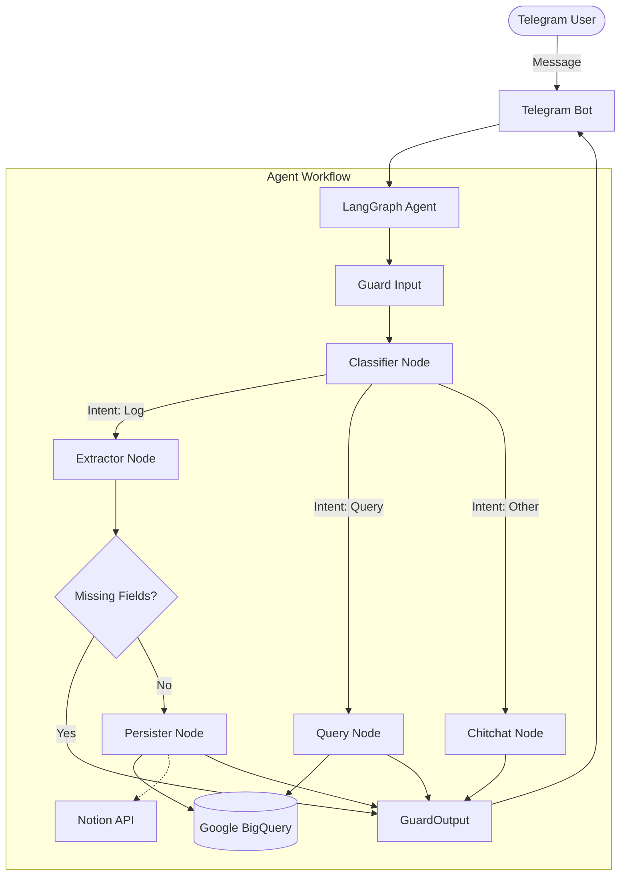

# My Tele PA (Personal Life OS Agent v2.0)

A production-grade Telegram bot agent that acts as a Personal Life OS. It tracks wellness (sleep, exercise, mood), tasks, reading links, and journal entries using **LangGraph**, **Instructor**, and **GPT-4o**. 

The system leverages conversational memory to naturally clarify missing information, rigidly validates extracted payloads using **Pydantic**, stores data centrally using **Google BigQuery**, and conditionally syncs all organized data straight to **Notion databases**.

## ✨ Features

- **Voice Note Parsing**: Send audio or voice notes; the bot transcribes them instantly using OpenAI Whisper and merges the context smoothly into your journal.
- **Contextual NLP Parsing**: Handles natural conversational language to log complex life entities at once.
- **Auto-Routing (Notion Sync)**: Pushes Reading Links, Tasks, Journal Entries, Exercise, specific Spiritual Practices (Sitting, Cleaning, Meditation), Habit Tracking, and Sleep straight to designated Notion databases seamlessly.
- **Unified Journaling (Mood & Energy)**: Subjective feelings and metrics (like Mood and Energy levels) are extracted and safely prepended to your rich-text journal entries to ensure the emotional narrative is never lost (e.g., `[Mood: 8/10] | [Energy: 7/10] I felt really productive today...`).
- **Natural Language Analytics (BigQuery)**: You can query your historical data naturally. E.g., *"How much did I sleep in the last 2 days?"* or *"What was my average mood this week?"* The agent translates this to active BigQuery Standard SQL, parses the results, and replies conversationally.
- **Interactive Clarification Loop**: If you provide partial data (e.g., "Went to the gym"), the agent pauses and asks for the missing fields (e.g., "Which body part did you train?").
- **Apple Health Integration SDK**: Built-in webhook for the 'Health Auto Export' iOS app to passively ingest Apple Health Sleep records into your Life OS.
- **Proactive Schedulers**: Automatically pings you at 8am daily for check-ins and Sunday at 7pm for a weekly digest.
- **Serverless Ready (Cloud Run)**: Fully compatible with Google Cloud Run using an optimized synchronous webhook design that scales to zero to save costs. Stateful checkpoints are preserved via mounted volumes.

---

## 🏗️ Architecture

The system runs as an asynchronous Telegram polling/webhook application paired with a robust Agentic Workflow:

- **LangGraph**: Orchestrates the state machine, routing between classification, entity extraction, missing-field logic loops, analytical querying, and database persistence.
- **Instructor**: Enforces deterministic JSON schemas directly from the OpenAI `gpt-4o` models.
- **Pydantic (v2)**: Validates typing and value thresholds across all extracted payloads.
- **Google BigQuery**: Provides high-speed serverless querying capability mapped naturally to Google Connected Sheets.
- **SQLite**: Handles `AsyncSqliteSaver` agent conversational memory checkpoints across serverless webhooks.

### Agentic Graph Flow


```mermaid
graph TD
    User([Telegram User]) -->|Message| Bot[Telegram Bot]
    Bot --> Graph[LangGraph Agent]
    
    subgraph Agent Workflow
        Graph --> GuardInput[Guard Input]
        GuardInput --> Classify[Classifier Node]
        
        Classify -- "Intent: Log" --> Extract[Extractor Node]
        Classify -- "Intent: Query" --> Query[Query Node]
        Classify -- "Intent: Other" --> Chitchat[Chitchat Node]
        
        Extract --> CheckMissing{Missing Fields?}
        CheckMissing -- "Yes" --> GuardOutput
        CheckMissing -- "No" --> Persist[Persister Node]
        
        Persist --> Storage[(Google BigQuery)]
        Persist -.-> Notion[Notion API]
        
        Query --> Storage
        Query --> GuardOutput
        Chitchat --> GuardOutput
        Persist --> GuardOutput
    end
    
    GuardOutput --> Bot
```

---

## 💬 Usage Examples

### 1. Multi-Entity Logging 
You can brain-dump multiple things at once. The extractor pulls them apart.

**User:** 
> "feeling good today, built a health journal app, had coffee, did 20 mins of sitting meditation at 7am, and need to call the dentist tomorrow"

**Bot:**
> I have logged the following:
> 🧘 Wellness: @ 07:00, 20 mins (Sitting)
> 📝 Journal: [Mood: 8/10] Feeling good today, built a health journal app, had coffee
> ✅ Tasks: call the dentist tomorrow
> 
> ✨ Synced to Notion!

### 2. The Clarification Loop
If you provide partial data, the bot knows what schema fields are missing and asks.

**User:** 
> "Went to the gym and did weights training"

**Bot:**
> Which body part(s) did you train? Options: Full body, Chest, Biceps, Triceps, Shoulders, Back, Abs, Lower body

**User:** 
> "chest and triceps, for 45 mins"

**Bot:**
> I have logged the following:
> 🏃 Exercise: Weights, 45 mins | Body: Chest, Triceps
> ✨ Synced to Notion!

### 3. Habit Tracking
The agent tracks specific, mindful negative (or positive) habits you want to monitor. Current supported categories include: `lost_self_control` (e.g. lost your temper, emotional outbursts), `junk_food`, `outside_food`, `late_eating`, `screen_time` (e.g. doomscrolling), and a catch-all `other`.

**User:** 
> "I lost my self control today and yelled at traffic, also watched netflix till 2am."

**Bot:**
> I have logged the following:
> 📊 Habit Tracker: Self Control: Yelled at traffic | Screen Time: Watched netflix till 2am
> 📝 Journal: I lost my self control today and yelled at traffic, also watched netflix till 2am.
> ✨ Synced to Notion!

### 4. Natural Language Analytics
**User:** 
> "How much did I sleep in the last 2 days?"

**Bot:**
> You slept an average of 7.2 hours over the last two days.

### 5. Reading List Auto-routing
**User:** 
> `https://medium.com/some-article-link`

**Bot:**
> I have logged the following:
> 🔖 Reading: 1 link(s) saved
> ✨ Synced to Notion!

---

## 📁 File Organization & Component Interaction

The repository is modularly designed, separating the generic Agent pipeline from the Telegram Interface. Development clutter has been strictly removed to ensure a clean production image.

```text
├── Dockerfile                    # Containerization instructions
├── Makefile                      # Make commands for testing, evals, format
├── simulation.py                 # CLI simulation script (bypasses Telegram for fast testing)
├── src/
│   └── life_os/
│       ├── agent/                # Core LangGraph agent definitions
│       │   ├── graph.py          # State graph wiring and execution compilation
│       │   ├── state.py          # Agent state typings
│       │   ├── prompts/          # System prompts for GPT-4o extractions & SQL Generation
│       │   └── nodes/            # 
│       │       ├── classifier.py # Routes to log, query, or chitchat
│       │       ├── extractor.py  # Uses Instructor to pull Pydantic models from text; handles merge logic
│       │       ├── persister.py  # Formats confirmation message & pushes to BigQuery/Notion
│       │       ├── query.py      # LLM powered native BigQuery SQL Analytics logic 
│       │       └── guard.py      # Prompt injection safety checks
│       ├── config/               # Pydantic env settings and structlog config
│       ├── evals/                # Custom evaluation datasets & F1 metric tracking (Mock-based)
│       ├── integrations/         # 
│       │   ├── bigquery_store.py # Async BigQuery clients supporting Cloud Run bindings
│       │   └── notion_store.py   # Tenacity-retried API calls to Notion databases
│       ├── models/               # 
│       │   ├── wellness.py       # Sleep, Exercise, and Wellness schemas (Including Habit Tracking)
│       │   └── tasks.py          # Task and ReadingLink schemas
│       └── telegram/             
│           ├── bot.py            # python-telegram-bot webhook handlers and polling core
│           └── jobs.py           # APScheduler cron jobs (morning check-in, weekly digest)
├── tests/
│   ├── integration/              # Pytest Asyncio tests covering LangGraph node chaining logic
│   └── unit/                     # Unit tests for LLM extractor accuracy and edge cases
```

---

## 🚀 Installation & Setup

1. **Clone the repository**
   ```bash
   git clone https://github.com/vaibhavd030/My-Tele-PA.git
   cd My-Tele-PA
   ```

2. **Install `uv` (Fast Python Package Installer)**
   ```bash
   curl -LsSf https://astral.sh/uv/install.sh | sh
   ```

3. **Sync Dependencies**
   ```bash
   uv sync
   ```

4. **Environment Setup**
   Copy the `.env.example` file and populate your keys. At minimum, you need an OpenAI API Key and a Telegram Bot token (from BotFather). Enable Notion sync by setting `ENABLE_NOTION=true` and providing the relevant Page/Database IDs.
   ```bash
   cp .env.example .env
   ```

5. **Initialize Database**
   The BigQuery structured databases are automatically instantiated with required dataset schemas when you start up the FastAPI bot. Checkpointer states will gracefully save to `/data`. 
   ```bash
   make dev
   ```

---

## 🧪 Running the Project

### Local Execution (Polling Mode)
Run the script to actively ping Telegram servers for incoming app messages.
```bash
make dev
```

### Local Simulation (Bypass Telegram)
Useful for testing agent logic quickly without accessing your phone.
```bash
uv run python simulation.py
```

### Evaluations and Tests
A test suite handles node executions, and a custom CI evaluation script tracks Agentic metric parsing accuracy over `GPT-4o` without requiring live GCP credentials.
```bash
make test
make eval
```

---

## ☁️ Serverless Deployment

For 24/7 availability on a serverless architecture (meaning you pay $0.00 when the bot is not in use), the application can be seamlessly deployed to Google Cloud Run bounding to a Webhook instead of polling.

This setup securely provisions Cloud Storage FUSE to handle durable conversation `.db` checkpoints across container resets.

For the required environment variables and `gcloud` deployment commands securely configured for `us-central1` instances, see [deploy.md](deploy.md).
